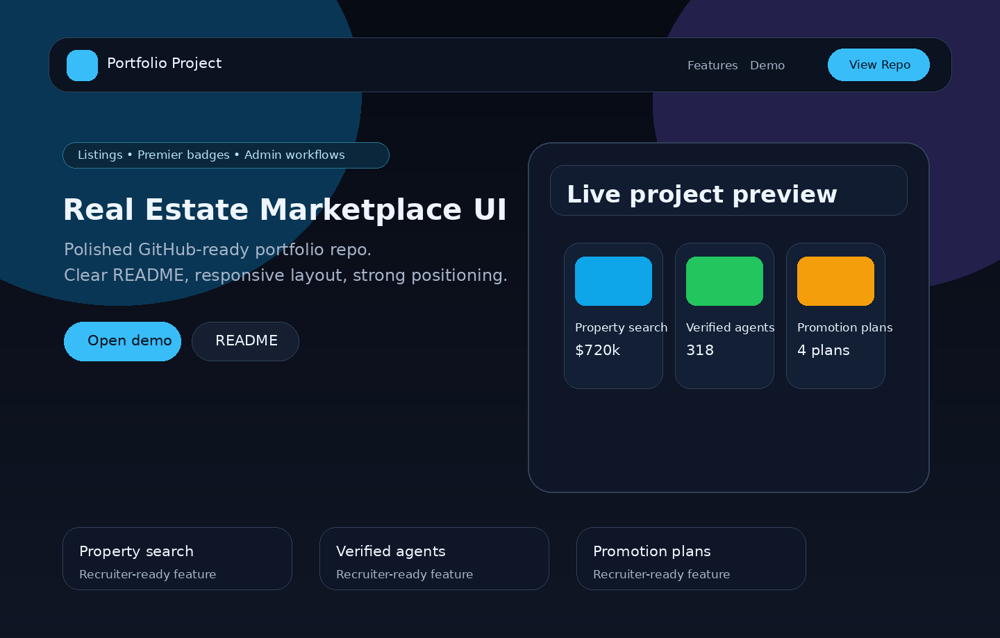

# Real Estate Marketplace UI

> A polished PropTech marketplace front-end for property discovery, premium listings, agent/agency positioning, and admin-style marketplace workflows.

Built by **Arsim Shefkiu** under **FullStackWithAI** — full-stack, AI-assisted, and data-driven web solutions.



## Why this project exists

This repo demonstrates product thinking for full-stack, frontend, and PropTech roles. It is designed like a real marketplace product rather than a basic landing page.

## Features

- Responsive marketplace landing page
- Property listing cards with filters and search
- Premier listing badges
- Agent, agency, and developer workflow sections
- Admin-style moderation and verification feature cards
- Mobile-first layout and accessible contrast choices

## Tech stack

- HTML5
- CSS3
- Vanilla JavaScript
- Responsive CSS Grid/Flexbox

## Run locally

Open `index.html` directly in your browser, or run:

```bash
npx http-server .
```

## Suggested GitHub description

`Premium responsive real estate marketplace UI with listings, filters, Premier badges, verification flows, and admin CRM concepts.`

## Future improvements

- Add authentication
- Connect listings to a database
- Add saved searches
- Add admin dashboard routes
- Add map provider integration

---

## Creator & Brand

<p align="center">
  
  
  
</p>

### Built by **Arsim Shefkiu** under **FullStackWithAI**

> **Premium PropTech marketplace interface for property discovery, verified listings, agent positioning, and real estate product workflows.**

| Brand Direction | Portfolio Value |
|---|---|
| **Luxury marketplace UI** | Shows ability to design premium listing experiences instead of generic pages |
| **PropTech product thinking** | Demonstrates understanding of search, filters, listings, agents, and verification |
| **Real estate credibility** | Positions the project for property platforms, agencies, and marketplace products |
| **Scalable frontend foundation** | Shows how a polished UI can evolve into a full-stack marketplace |

**Professional Focus:** I build polished real estate and marketplace interfaces that combine premium visual presentation, responsive frontend execution, and business-ready product structure.

**Why it matters:** Hiring managers, founders, and CEOs can see the ability to turn a business model into a credible digital product experience.

<p align="center">
  <a href="https://www.designhubmk.com"><strong>www.designhubmk.com</strong></a> · <strong>arsim@designhubmk.com</strong> · <a href="https://github.com/fullstackwithai"><strong>GitHub: fullstackwithai</strong></a>
</p>

<p align="center">
  <strong>FullStackWithAI</strong> · PropTech UI · Marketplace systems · Premium listings · AI-assisted product thinking
</p>
